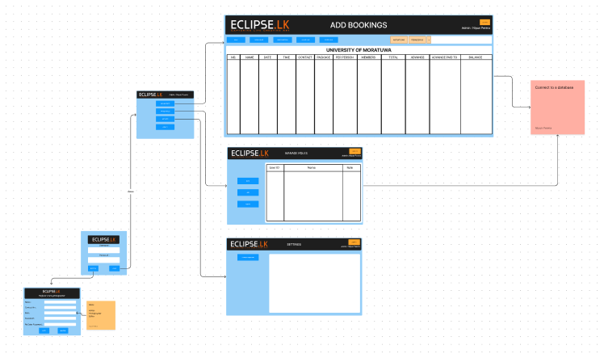
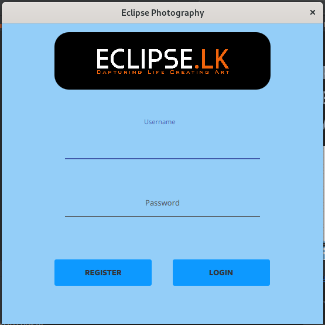

# ECLIPSE PHOTOGRAPHY - ORDERS & EMPLOYEES MANAGEMENT SYSTEM

#### -- On Going Project --



<p> This orders & employee's management system is developing for a photography business. This is an ongoing JavaFX project and 25% of the project is completed already.

In this project, there are three main roles who have access to the application. 

<b>Admins</b> have full access to the application and able to control every function of the application. They can manage users, manage orders and manage payments.

<b>Photographers</b> and <b>Editors</b> have limited access to the application and able to see their monthly payments updates by the admins.

FIGMA designs are shown above in order to give the basic idea about the application.
</p>

## Built with using

* Java 11 
* JavaFX 
* MySQL 


## How to use this repository

* Open the terminal
* Then clone the repo using
```
git clone https://github.com/nipunsperera/eclipse-photography.git
```


<!-- CONTACT -->
## Contact

Nipun Perera - [@LinkedIn](https://www.linkedin.com/in/nipunperera96/)

Project Link: [https://github.com/nipunsperera/eclipse-photography.git](https://github.com/nipunsperera/eclipse-photography.git)